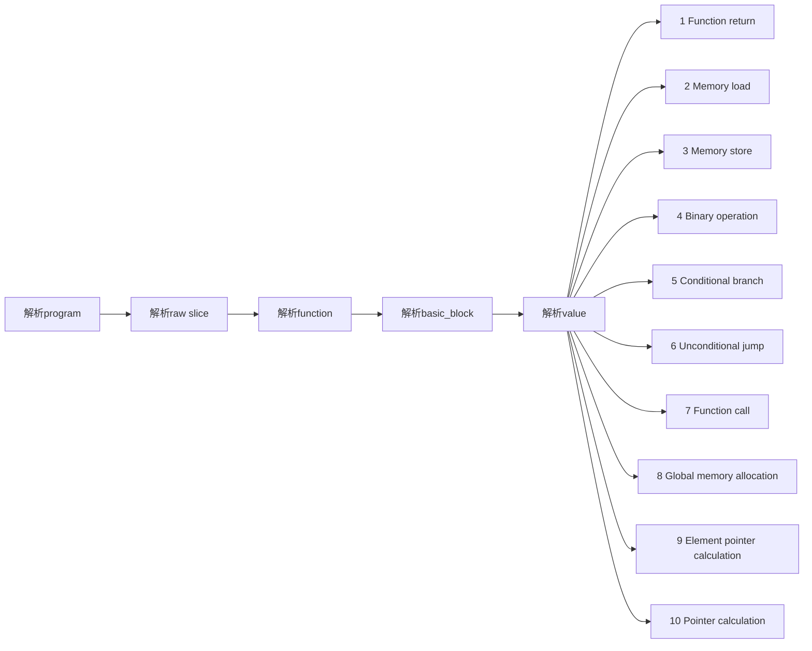
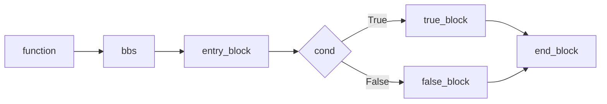

# 编译原理课程实践报告：PKU-Compiler-CRay

信息科学技术学院 2200012913 陈子睿  

## 一、编译器概述

### 1.1 基本功能

本编译器基本具备如下功能：
+ **基本的表达式**:支持处理常用的一元、算术、比较和逻辑表达式，能处理常量和变量。
+ **条件判断和循环语法**:支持处理if/else条件判断语句，以及while循环语句。
+ **函数**:支持main函数解析以及函数的定义和调用，支持语句块和作用域的处理，支持全局变量。
+ **数组**:支持对数组的处理，包括一维、多维数组，支持数组参数。
### 1.2 主要特点

本编译器的主要特点是**分层表示**、**低耦合**、**模块化**、**轻量化**。
+ **分层表示**：分为三层，（1）经过词法分析和语法分析，先得到抽象语法树；（2）再通过遍历抽象语法树生成Koopa IR；（3）生成对应的RISC-V 汇编文件。
+ **低耦合**：上述各层独立运行，接口清晰，没有需要共享的数据。
+ **模块化**：词法分析、语法分析、IR生成、汇编生成模块独立，各模块内的数据结构封装成类。
+ **轻量化**：所有变量局部变量都保存在栈中，实现简单起见，没有进行寄存器分配。代码结构和逻辑简洁、易懂。

## 二、编译器设计

### 2.1 主要模块组成

编译器主要由以下四大模块组成：

+ **词法分析模块**: 负责词法分析，将SysY源程序转换为token流。(对应源代码中`sysy.l`)
+ **语法分析模块**: 负责语法分析，得到`AST.h`中定义的抽象语法树。(对应源代码中`sysy.y`)
+ **IR生成模块**: 负责遍历抽象语法树，进行语义分析，得到 Koopa IR 中间表示。(对应源代码中`AST.h、AST.cpp`)
+ **代码生成模块**: 负责扫描Koopa IR，将其转换为RISC-V代码。(对应源代码中`riscv.h、riscv.cpp`)

模块之间的数据流图如下。


除了这四个模块，还定义了一个辅助模块，`utils.h、utils.cpp`,定义了类型、符号表、块、循环等相关的类，`Value、SymbolVector、BlockVector、LoopVector`。

### 2.2 主要数据结构

#### 2.2.1 抽象语法树AST

本编译器最核心的数据结构是抽象语法树（Abstract Syntax Tree, AST）。AST对应的的定义和实现见`AST.h`和`AST.cpp`。

（1）`BaseAST` 是所有 AST 节点的基类，定义了转换为 Koopa 中间表示的虚函数。这个基类确保了所有 AST 节点都可以被统一处理。

```cpp
class BaseAST {
public:
    virtual ~BaseAST() = default;
    virtual void *to_koopa() const { return nullptr; }
    // 其他虚函数声明...
};
```

（2）`CompUnitAST` 表示一个完整的编译单元，是 AST 的根节点。它包含了一个`DefAST`类型的向量，用于存储所有顶级“定义”（如函数定义、变量声明等）。

```cpp
class CompUnitAST : public BaseAST {
public:
    unique_ptr<vector<unique_ptr<BaseAST>>> def_vec;
    CompUnitAST(unique_ptr<vector<unique_ptr<BaseAST>>> &def_vec);
    void *to_koopa() const override {
        // 实现转换为Koopa中间表示
    }
    // 其他成员函数...
};
```

例如，一个包含两个函数定义的编译单元可以表示为：

```cpp
unique_ptr<BaseAST> func1 = make_unique<FuncDefAST>(...);
unique_ptr<BaseAST> func2 = make_unique<FuncDefAST>(...);
unique_ptr<vector<unique_ptr<BaseAST>>> def_vec = make_unique<vector<unique_ptr<BaseAST>>>();
def_vec->push_back(move(func1));
def_vec->push_back(move(func2));
unique_ptr<CompUnitAST> comp_unit = make_unique<CompUnitAST>(move(def_vec));
```

`CompUnitAST`对应的语法规范示例如下：

```
CompUnit      ::= [CompUnit] (Decl | FuncDef);
Decl          ::= ConstDecl | VarDecl;
ConstDecl     ::= "const" BType ConstDef {"," ConstDef} ";";
BType         ::= "int";
ConstDef      ::= IDENT {"[" ConstExp "]"} "=" ConstInitVal;
ConstInitVal  ::= ConstExp | "{" [ConstInitVal {"," ConstInitVal}] "}";
VarDecl       ::= BType VarDef {"," VarDef} ";";
VarDef        ::= IDENT {"[" ConstExp "]"}
                | IDENT {"[" ConstExp "]"} "=" InitVal;
InitVal       ::= Exp | "{" [InitVal {"," InitVal}] "}";
FuncDef       ::= FuncType IDENT "(" [FuncFParams] ")" Block;
FuncType      ::= "void" | "int";
FuncFParams   ::= FuncFParam {"," FuncFParam};
FuncFParam    ::= BType IDENT ["[" "]" {"[" ConstExp "]"}];
Block         ::= "{" {BlockItem} "}";
BlockItem     ::= Decl | Stmt;
Stmt          ::= LVal "=" Exp ";"
                | [Exp] ";"
                | Block
                | "if" "(" Exp ")" Stmt ["else" Stmt]
                | "while" "(" Exp ")" Stmt
                | "break" ";"
                | "continue" ";"
                | "return" [Exp] ";";
Exp           ::= LOrExp;
LVal          ::= IDENT {"[" Exp "]"};
PrimaryExp    ::= "(" Exp ")" | LVal | Number;
Number        ::= INT_CONST;
UnaryExp      ::= PrimaryExp | IDENT "(" [FuncRParams] ")" | UnaryOp UnaryExp;
UnaryOp       ::= "+" | "-" | "!";
FuncRParams   ::= Exp {"," Exp};
MulExp        ::= UnaryExp | MulExp ("*" | "/" | "%") UnaryExp;
AddExp        ::= MulExp | AddExp ("+" | "-") MulExp;
RelExp        ::= AddExp | RelExp ("<" | ">" | "<=" | ">=") AddExp;
EqExp         ::= RelExp | EqExp ("==" | "!=") RelExp;
LAndExp       ::= EqExp | LAndExp "&&" EqExp;
LOrExp        ::= LAndExp | LOrExp "||" LAndExp;
ConstExp      ::= Exp;
```

（3）其它各类AST

从`DefAST`开始，递归调用其它各类`AST`，如`FuncDefAST`、`StmtAST`、`IfAST`、`ExpAST`、`NumberAST`等等，最终完成对整个program的分析。

上述各类`AST`定义了对应的属性和`to_koopa`函数。

以`IfAST`为例，表示一个 `if` 语句，包含一个条件表达式和一个执行语句。在处理 `if else` 语句时，编译器需要准确解析条件和执行路径，`IfAST` 节点为此提供了支持。

```cpp
class IfAST : public BaseAST {
public:
    unique_ptr<BaseAST> exp;
    unique_ptr<BaseAST> stmt;
    IfAST(unique_ptr<BaseAST> &exp, unique_ptr<BaseAST> &stmt);
    void *to_koopa() const override {
        // 实现条件语句的中间表示
    }
};
```

例如，一个简单的 `if` 语句可以表示为：

```cpp
unique_ptr<BaseAST> condition = make_unique<RelExpAST>(...);
unique_ptr<BaseAST> then_stmt = make_unique<StmtAST>(...);
unique_ptr<IfAST> if_stmt = make_unique<IfAST>(move(condition), move(then_stmt));
```

以`FuncDef`为例，抽象语法树各个结点类的定义和语法规范意义对应。

`FuncDef`对应的 AST 定义如下：

```cpp
class FuncDefAST : public BaseAST {
public:
  unique_ptr<BaseAST> func_type;    // 返回值类型
  string ident;                     // 函数名标识符
  unique_ptr<BaseAST> block;        // 函数体
  unique_ptr<vector<unique_ptr<BaseAST>>> param_vec;    // 函数参数
  void *to_koopa() const override;  //生成koopa IR
};
```

对应的`FuncDef`语法规范：

```
FuncDef       ::= FuncType IDENT "(" [FuncFParams] ")" Block;
```
#### 2.2.2 RISCV类
定义RISCV_Module类，封装了生成 RISC-V 汇编代码所需的各种功能，包括地址管理、指令生成、函数和基本块的处理等。RISCV_Module对应的的定义和实现见`riscv.h`和`riscv.cpp`。

RISCV_Module类的工作流程如下：

（1）从program入口，依次递归解析raw slice、function、basic_block、value；

（2）根据value的类型，判断后续进入的分支，并进行对应处理。

（3）将raw以RISCV汇编格式输出到文件。




```cpp
//RISCV汇编生成模块
class RISCV_Module {
  //内部类 Env,用于管理栈空间和地址映射
  class Env {
    map<koopa_raw_value_t, int> addr_map;  //存储指令与其在栈中的地址的映射关系
   public:
    int stack_size = 0;   //当前栈空间的总大小
    int cur_size = 0;     //当前已分配的栈空间大小
    bool is_call = false; //当前函数是否包含函数调用

    void init(int size, bool call);   //初始化栈空间和函数调用标志
    int get_addr(koopa_raw_value_t value);    //获取指令在栈中的地址。如果指令尚未分配地址，则为其分配一个新的地址。

  };
  Env env;

  ofstream out;   //用于将生成的汇编代码写入文件
  //计算 Koopa IR 中类型的大小（字节数）
  static int type_size(koopa_raw_type_t ty);
  //计算数组类型的大小
  static int array_size(koopa_raw_type_t value);
  //计算基本块的大小
  static int bb_size(koopa_raw_basic_block_t bb, bool &call, int &max_arg);
  //计算单条指令的大小
  static int inst_size(koopa_raw_value_t value);
  //计算函数的大小
  static int func_size(koopa_raw_function_t func, bool &call);
  //将值从内存加载到寄存器
  void load_register(koopa_raw_value_t value, string reg);
  //将值从寄存器存储到栈中
  void store_stack(int addr, string reg);

  // 解析program
  void raw_analyze(const koopa_raw_program_t &raw);
  // 解析 raw slice
  void raw_analyze(const koopa_raw_slice_t &slice);
  // 解析函数
  void raw_analyze(const koopa_raw_function_t &func);
  // 解析基本块
  void raw_analyze(const koopa_raw_basic_block_t &bb);
  
  // 解析指令
  void raw_analyze(const koopa_raw_value_t &value);
  // 1. Function return
  void raw_analyze(const koopa_raw_return_t &return_value);
  // 2. Memory load
  void raw_analyze(const koopa_raw_load_t &load_value, int addr);
  // 3. Memory store
  void raw_analyze(const koopa_raw_store_t &store_value);
  // 4. Binary operation
  void raw_analyze(const koopa_raw_binary_t &binary_value, int addr);
  // 5. Conditional branch
  void raw_analyze(const koopa_raw_branch_t &branch_value);
  // 6. Unconditional jump
  void raw_analyze(const koopa_raw_jump_t &jump_value);
  // 7. Function call
  void raw_analyze(const koopa_raw_call_t &call_value, int addr);
  // 8. Global memory allocation
  void global_alloc(const koopa_raw_value_t &global_alloc_value);
  // aggregate
  void raw_analyze(const koopa_raw_aggregate_t &aggregate_value);
  // 9. Element pointer calculation
  void raw_analyze(const koopa_raw_get_elem_ptr_t &get_elem_ptr_value, int addr);
  // 10. Pointer calculation
  void raw_analyze(const koopa_raw_get_ptr_t &get_ptr_value, int addr);

 public:
   RISCV_Module(const char *path) {
      out.open(path);
   };
  //将raw以RISCV汇编格式输出到文件 
  void raw_dump_to_riscv(koopa_raw_program_t raw);
};
```

#### 2.2.3 结构体和类定义

在`utils.h`中主要定义了`Value`结构体，以及如下类：`SymbolVector、BlockVector、LoopVector`。

`SymbolVector` 和`Value`在下一小节符号表中再详细介绍。

`BlockManager` 用于管理基本块，它负责创建、添加指令和删除不可达的基本块。这有助于优化控制流和提高代码的效率。
```
class BlockVector {
private:
  vector<const void *> *block_list_vector;
  vector<const void *> tmp_inst_list;

public:
  void init(vector<const void *> *block_list_vector);
  void newBlock(koopa_raw_basic_block_data_t *basic_block);
  void delBlock();
  void addInst(const void *inst);
  void delUnreachableBlock();
  bool checkBlock();
};
```

例如，创建一个新的基本块并添加指令：

```cpp
koopa_raw_basic_block_data_t *new_block = new koopa_raw_basic_block_data_t();
block_manager.newBlock(new_block);
block_manager.addInst(some_instruction);
```

`LoopManager` 用于管理循环结构，它跟踪循环的头部和尾部，以便进行循环展开和其他优化。
```
class LoopVector {
private:
  struct While {
    koopa_raw_basic_block_t head;
    koopa_raw_basic_block_t tail;
    While(koopa_raw_basic_block_t head, koopa_raw_basic_block_t tail)
        : head(head), tail(tail) {}
  };
  vector<While> while_list;

public:
  void addWhile(koopa_raw_basic_block_t head, koopa_raw_basic_block_t tail);
  void delWhile();
  koopa_raw_basic_block_t getHead();
  koopa_raw_basic_block_t getTail();
};
```

例如，添加一个循环：

```cpp
koopa_raw_basic_block_t loop_head = new koopa_raw_basic_block_data_t();
koopa_raw_basic_block_t loop_tail = new koopa_raw_basic_block_data_t();
loop_manager.addWhile(loop_head, loop_tail);
```

### 2.3 主要设计考虑及算法选择

#### 2.3.1 符号表的设计考虑

1.**定义`ValueType`**

包含用到的五种值类型`Const, Var, Func, Array, Pointer`。然后定义结构体Value，将此5种类型与koopa-IR中的类型一一关联起来。

```cpp
enum ValueType { Const, Var, Func, Array, Pointer};
struct Value {
  ValueType type;
  union SymbolVectorValue {
    int const_value;
    koopa_raw_value_t var_value;
    koopa_raw_function_t func_value;
    koopa_raw_value_t array_value;
    koopa_raw_value_t pointer_value;
  }
  //......
}
```

2.**设计符号表`SymbolVector`**

这一个`vector<map<string, Value>>`类型的表。`string`是`symbol_list_vector`的标识和索引，`Value`是`symbol_list_vector`的值。通过`addSymbol(string symbol, Value value)`往符号表中增加记录，通过`getSymbol(string symbol)`获得对应表示符号的值；`newScope()`、`delScope()`通过`push_back(map<string, Value>())`、`pop_back()`扩充和压缩列表符号表空间。
```cpp
class SymbolVector {
private:
  vector<map<string, Value>> symbol_list_vector;

public:
  ~SymbolVector() = default;
  void addSymbol(string symbol, Value value);
  Value getSymbol(string symbol);
  void newScope();
  void delScope();
};
void SymbolVector::newScope() {
  symbol_list_vector.push_back(map<string, Value>());
}
void SymbolVector::delScope() { 
  symbol_list_vector.pop_back(); 
}
```
3.**变量作用域的处理**

`koopa_raw_value_data` 类型包含了变量作用域属性。属性 `kind.tag` ，其值为 `KOOPA_RVT_GLOBAL_ALLOC`，则表示是全局变量。结合代码说明如下：

```cpp
//AST.CPP
void *VarDefAST::to_koopa(vector<const void *> &global_var,koopa_raw_type_t var_type) const {
  // 为了清晰说明变量域，其它代码省去。以下函数类似。
    koopa_raw_value_data *ret = new koopa_raw_value_data();
    ret->name = name;
    ret->kind.tag = KOOPA_RVT_GLOBAL_ALLOC;   //kind.tag设为为全局变量属性KOOPA_RVT_GLOBAL_ALLOC
    Value value = Value(ValueType::Var, ret); //赋值给Value
    symbol_list.addSymbol(ident.c_str(), value);  //  加入到符号表
}
```

```cpp
//riscv.cpp
void RISCV_Module::raw_analyze(const koopa_raw_value_t &value) {
  const auto &kind = value->kind;
  switch (kind.tag){            //根据指令类型判断后续需要如何访问
  case KOOPA_RVT_GLOBAL_ALLOC:  //Global memory allocation
    global_alloc(value);
  //......
  }
}
```

```cpp
//riscv.cpp
void RISCV_Module::global_alloc(const koopa_raw_value_t &g_value) {
  out << "\n  .global " + string(g_value->name + 1) + "\n";  //转成汇编语言 .global
  out << string(g_value->name + 1) + ":\n";
  if (g_value->kind.data.global_alloc.init->kind.tag == KOOPA_RVT_INTEGER)
    //......
  if (g_value->kind.data.global_alloc.init->kind.tag == KOOPA_RVT_ZERO_INIT) 
      //......
  if (g_value->kind.data.global_alloc.init->kind.tag == KOOPA_RVT_AGGREGATE) 
    //......
}
```

#### 2.3.2 寄存器分配策略

+ **核心分配策略**

总体而言，是按照按需进行分配，也就是需要的时候，将栈上的变量加载到对应的寄存器中，使用完毕后，将寄存器的值回写到栈上，这种做法避免了复杂的动态寄存器分配算法，是一种简单好用的分配策略。

+ **具体设计**

设计上，有如下两个关键的函数:

1. **加载函数**

   ```c
   /**
    * 将给定的值加载到指定的寄存器中。
    * 
    * 此函数根据值的类型，将一个 Koopa 中间表示的值加载到 RISC-V 寄存器中。
    * 它处理两种情况：整数立即数和存储在栈上的值。
    * 
    * @param value 要加载的 Koopa 中间表示值。
    * @param reg 目标 RISC-V 寄存器的名称。
    */
   void RISCV_Module::load_register(koopa_raw_value_t value, string reg) {
     if (value->kind.tag == KOOPA_RVT_INTEGER) {
       out << "  li " + reg + ", " +
                  to_string(value->kind.data.integer.value) + "\n";
     } else {
       int addr = env.get_addr(value);
       if (addr != -1) {
         if (addr < 2048 && addr >= -2048) {
           out << "  lw " + reg + ", " + to_string(addr) + "(sp)\n";
         } else {
           out << "  li t3, " + to_string(addr) + "\n";
           out << "  add t3, sp, t3\n";
           out << "  lw " + reg + ", 0(t3)\n";
         }
       } else {
         assert(false);
       }
     }
   }
   ```

   这段代码的功能是将一个Koopa值加载到指定的RISC-V寄存器中。具体逻辑如下：

   (1)整数类型处理：如果值是整数，则直接使用`li`指令将该整数值加载到寄存器中。
   (2)地址查找与加载：
    - 如果值不是整数，尝试通过evn内部类获取变量的地址。
    - 如果地址有效且在-2048到2048范围内，使用`lw`指令直接加载。
    - 如果地址超出范围，先用`li`和`add`指令计算地址，再用`lw`加载。

  ```mermaid
  graph LR
       A[开始] --> B{值是否为整数?}
       B -->|是| C[使用 li 指令加载整数]
       B -->|否| D[获取值的地址]
       D --> E{地址是否有效?}
       E -->|否| F[断言失败]
       E -->|是| G{地址是否在 -2048 到 2048 范围内?}
       G -->|是| H[使用 lw 指令加载]
       G -->|否| I[计算地址并加载]
  ```

   几点说明:

   (1) **整数直接加载**：如果 `value` 是整数（`KOOPA_RVT_INTEGER`），可以直接使用 `li` 指令将该整数值立即加载到目标寄存器中。（`li` 指令用于加载立即数（immediate value），即常量值，操作简单且高效）

   (2) **非整数的复杂处理**：

      - 如果 `value` 不是整数，通常它是一个变量或表达式的结果，需要从内存中加载。
      - 需要先通env.get_addr(value)获取该值的内存地址。
      - 根据地址的不同情况（是否在特定范围内），选择不同的加载方式：
        - 地址在 -2048 到 2048 范围内：使用 `lw` 指令直接从栈指针 `sp` 加载。
        - 地址超出此范围：需要先计算地址，再进行加载。

   (3) **-2048和2048**

      在 RISC-V 汇编代码生成过程中，地址判断限制在 -2048 到 2048 之间的原因主要与 RISC-V 的指令集架构（ISA）和 immediates（立即数）的编码方式有关。具体原因如下：

      **RISC-V 指令格式**：
      - RISC-V 的 `lw`（load word）指令支持立即数偏移量（immediate offset），用于从内存中加载数据。
      - 这个偏移量是一个 12 位有符号整数，范围是 -2048 到 2047（即 -2^11 到 2^11-1）。这是因为 12 位二进制数可以表示的有符号整数范围。

      **超出范围的处理**：
      - 如果地址偏移量超出了 -2048 到 2047 的范围，无法直接用一条 `lw` 指令完成加载。
      - 需要先将地址计算到一个临时寄存器（如 `t3`），然后再使用 `lw` 指令从该临时寄存器加载数据。这需要多条指令，增加了复杂性和指令数量。

2. **恢复函数**

   ```c
   /**
    * RISCV_Module::store_stack - 将寄存器的值存储到栈中
    * @addr: 相对于栈指针(sp)的偏移地址
    * @reg:  需要存储的寄存器名称
    * 
    * 此函数根据给定的偏移地址和寄存器名称，生成相应的指令将寄存器的值存储到栈中。
    * 如果偏移地址超出了某些范围，则需要使用额外的指令来计算地址。
    * 如果给定的偏移地址为-1，则视为无效输入并断言失败。
    */
   void RISCV_Module::store_stack(int addr, string reg) {
     if (addr != -1) {
       if (addr < 2048 && addr >= -2048) {
         out << "  sw " + reg + ", " + to_string(addr) + "(sp)\n";
       } else {
         out << "  li t3, " + to_string(addr) + "\n";
         out << "  add t3, sp, t3\n";
         out << "  sw " + reg + ", 0(t3)\n";
       }
     } else {
       assert(false);
     }
   }
   ```

   这段代码的功能是将寄存器中的值存储到栈中指定的地址。具体逻辑如下：

   (1) **检查地址是否有效**：如果 `addr` 不等于 -1，继续执行；否则触发断言失败。
   
   (2) **判断地址范围：**
    - 如果 `addr` 在 [-2048, 2047] 范围内，直接使用 `sw` 指令将寄存器的值存储到栈指针偏移后的地址。
    - 否则，先将 `addr` 加载到临时寄存器 `t3`，再通过 `add` 指令计算最终地址，最后使用 `sw` 指令存储。

  ```mermaid
  graph LR
       A[开始] --> B{地址是否有效?}
       B -->|No| C[断言失败]
       B -->|Yes| D{地址是否在范围内?}
       D -->|Yes| E[直接存储到栈]
       D -->|No| F[加载地址到临时寄存器]
       F --> G[计算最终地址]
       G --> H[存储到栈]
  ```

   说明：

   当 `addr` 不在 [-2048, 2047] 范围内时，需要多条指令来完成存储任务的原因在于 RISC-V 指令集的限制和硬件架构的特点：

   (1) **立即数范围限制**：
      - RISC-V 的 `sw`（store word）指令只能接受一个小的立即数偏移量（12 位有符号整数），即偏移量必须在 [-2048, 2047] 范围内。
      - 如果 `addr` 超出这个范围，无法直接用一条 `sw` 指令完成存储操作。

   (2) **分步计算地址**：
      - 当 `addr` 超出立即数范围时，需要先将 `addr` 加载到一个临时寄存器（如 `t3`），然后通过 `add` 指令将栈指针 `sp` 和 `t3` 相加，得到最终的目标地址。
      - 最后再使用 `sw` 指令将寄存器中的值存储到计算出的目标地址。

我们用一个例子来说明寄存器的分配是按需分配，考虑如下程序:

```c
int a = 10;
int b = 20;
int c = a + b;
return c;
```

我们的分配函数可以如下:

```c
void RISCV_Module::raw_analyze(const koopa_raw_value_t &value, int addr) {
    // 伪代码对应的 RISC-V 实现
    // 1. 定义 a = 10 和 b = 20
    koopa_raw_value_t a, b, c;
    // 分配栈空间
    print("  addi sp, sp, -16\n");
    // 初始化 a 和 b
    print("  li t0, 10\n");
    store_stack("t0", a); // 存储 a 到栈
    print("  li t1, 20\n");
    store_stack("t1", b); // 存储 b 到栈
    // 按需加载 a 和 b 到寄存器
    load_register("t0", a); // 加载 a 到 t0
    load_register("t1", b); // 加载 b 到 t1
    // 执行加法运算
    print("  add t2, t0, t1\n");
    // 存储结果 c 到栈
    store_stack("t2", c);
    // 恢复栈指针
    print("  addi sp, sp, 16\n");
}

```

对应的汇编代码如下:

```assembly
  addi sp, sp, -16
  li t0, 10
  sw t0, -4(sp)
  li t1, 20
  sw t1, -8(sp)
  lw t0, -4(sp)
  lw t1, -8(sp)
  add t2, t0, t1
  sw t2, -12(sp)
  addi sp, sp, 16
```

#### 2.3.3 采用的优化策略

1. **内存管理优化**：通过使用智能指针（`unique_ptr`），自动管理 AST 节点的生命周期，避免内存泄漏。例如，在 `CompUnitAST` 中，`def_vec` 使用 `unique_ptr` 来管理定义向量，确保在 `CompUnitAST` 被销毁时，所有子节点也被正确释放。

2. **中间代码生成优化**：在将 AST 转换为 Koopa 中间代码时，进行了一系列优化，如死代码消除、循环展开等。例如，在 `RISCV_Module` 类中，通过分析基本块和指令，可以删除不必要的指令，优化循环的结构。

3. **错误处理优化**：进行了详细的错误检测和处理，包括语法错误、类型错误等，提高编译器的健壮性。例如，在 `BaseAST` 的 `to_koopa` 方法中，如果遇到未实现的转换，会通过断言来触发错误。

#### 2.3.4 其它补充设计考虑

1. **可扩展性**：编译器的前端和后端设计为可扩展的插件式架构，允许用户根据需要添加新的功能或优化。例如，用户可以轻松地添加新的 AST 节点类型或修改代码生成策略，而不需要修改编译器的核心代码。

2. **用户友好性**：提供了丰富的错误信息和警告，帮助开发者快速定位和解决问题。例如，当遇到语法错误时，编译器会提供详细的错误位置和可能的修复建议。

通过这些设计和优化策略，编译器能够高效地处理源代码，生成优化的中间代码，并提供良好的用户体验。

## 三、编译器实现

### 3.1 各阶段编码细节

#### Lv1. main函数和Lv2. 初试目标代码生成

在lv1、Lv2中我们熟悉编译器的处理完整流程。在这个阶段，只有一个函数和一个基本块，IR的结构如下：


> 在lv1中，我们先定义了一个程序，然后向其funcs中添加函数，再向函数的bbs中添加基本块，最后向基本块的insts中添加指令，该生成什么指令和SysY代码相关，这个流程在lv6之前都是一样的。

#### Lv3. 表达式

lv3中新增了表达式计算，对应koopa_raw_binary_t。

详见riscv.cpp 第380行，void RISCV_Module::raw_analyze(const koopa_raw_binary_t &b_value, int addr) 。

koopa_raw_binary_t有以下三个属性：

- op：类型为koopa_raw_binary_op_t，指示了运算的类型，具体的类型可以查看注释；
- lhs：类型为koopa_raw_value_t，指示了左操作数；
- rhs：类型为koopa_raw_value_t，指示了右操作数。

从这个结构可看到，创建一个二元运算的过程包括：解析AST得到运算类型；创建lhs和rhs对应的value。最后，创建一个binary，依据上面三个属性进行计算。
 
注意：

（1）对于一元运算-和!(+不用生成IR)，你需要将其转换为二元运算，例如-1应该转换为0-1，!1应该转换为1==0，这样才能正确生成IR。

（2）对于逻辑运算符&&和||，Koopa IR的KOOPA_RBO_AND和KOOPA_RBO_OR是bitwise的，而不是logical的，我们将lhs和rhs转换为0或1，然后再进行运算。

#### Lv4. 常量和变量

常量部分的生成没有任何新的添加，变量部分的生成新增了三个value，分别是alloc、load和store。

详见riscv.cpp 第324行，第341行：

void RISCV_Module::raw_analyze(const koopa_raw_load_t &l_value, int addr)，

void RISCV_Module::raw_analyze(const koopa_raw_store_t &s_value)

相关结构如下：

- alloc：alloc没有对应的数据域，只需要将kind.tag设为KOOPA_RVT_ALLOC，只有两个需要使用的属性，分别是：
  - name：alloc的名字，Koopa IR不用处理重名问题，直接设置为@+变量名即可；
  - ty：alloc的类型，应该与变量的类型相同，在lv9之前，变量的类型只有INT32。
- load：load的数据域为koopa_raw_load_t，有一个属性，是：
  - src：load的源，类型为koopa_raw_value_t。
- store：store的数据域为koopa_raw_store_t，有两个属性，分别是：
  - dest：store的目的地，类型为koopa_raw_value_t；
  - value：store的值，类型为koopa_raw_value_t。

> load的src和store的dest都必须是kind.tag为KOOPA_RVT_ALLOC的value。store value的类型是UNIT(void)，load value的类型是INT32。

例如，对于int a = 1;，我们需要创建一个alloc，名字为@a，类型为INT32，然后创建一个store，dest为@a，然后创建一个integer，值为1，就完成了对a的定义和赋值。

#### Lv5. 语句块和作用域

这一小节新增了作用域的概念，语句块只涉及到作用域的嵌套，所以不用添加多个基本块，只需要维护好符号表即可。由于Koopa IR能自动处理变量名重复的问题，所以我们不需要处理重名问题，例如遇到多个a，可以直接将名字都设置为@a。
作用域在前面已详细介绍，不再重复。

#### Lv6. if语句

Lv6新增if语句，实现控制流的转移。程序结构如下：



Koopa IR中的控制流转移有以下几种：
- br: 条件分支，有五个属性，分别是：
  - cond：条件，类型为koopa_raw_value_t；
  - true_block：条件为真时跳转的基本块，类型为koopa_raw_basic_block_t；
  - false_block：条件为假时跳转的基本块，类型为koopa_raw_basic_block_t；
  - true_args：条件为真时跳转的基本块的参数，类型为koopa_raw_slice_t；
  - false_args：条件为假时跳转的基本块的参数，类型为koopa_raw_slice_t。
- jump: 无条件跳转，属性分别是：
  - target：跳转的基本块，类型为koopa_raw_basic_block_t；
  - args：跳转的基本块的参数，类型为koopa_raw_slice_t。

处理过程为；
（1）当遇到if语句时，创建一个条件分支br，cond为if的条件；
（2）true_block为条件为真时跳转的基本块，false_block为条件为假时跳转的基本块；
（3）当遇到true_block、false_block结尾，创建一个jump，target为if的end_block。

在Lv6中，我们创建了BlockVector存放所有的基本块，生成的指令保存在对应的基本块中。BlockVector在前面已介绍，不再重复。

#### Lv7. while语句

Lv7新增了while语句，由于循环语句本质上和分支语句相同，因此在Koopa IR生成中没有新增内容。

(1) 为了处理break和continue，我们新增了一个数据结构LoopVector来保存当前的循环。LoopVector在前面已介绍，不再重复。

(2) 要注意处理跳转块，break调准到当前循环的end_block；continue应该跳转到body_block。

#### Lv8. 函数和全局变量

lv8新增了函数和全局变量，以及函数的调用和函数的参数传递。

详见riscv.cpp 第458行，void RISCV_Module::raw_analyze(const koopa_raw_call_t &c_value, int addr) 。

对应到Koopa IR中，新增的内容有：

- call：对应的数据域为koopa_raw_call_t，有三个属性，分别是：
  - callee：调用的函数，类型为koopa_raw_function_t；
  - args：调用的参数，类型为koopa_raw_slice_t，存储的是koopa_raw_value_t。
- function：lv8中新增了以下两个部分：
  - params：函数的参数列表，类型为koopa_raw_slice_t，存储的是koopa_raw_value_t，tag为KOOPA_RVT_FUNC_ARG_REF；
  - ty：函数的类型，lv1中介绍了部分，lv8中新增了以下两个部分：
    - params：函数的参数类型，类型为koopa_raw_slice_t，存储的是koopa_raw_type_t；
    - ret：函数的返回值类型，类型为koopa_raw_type_t，新增了UNIT(void)。
- func_arg_ref：函数的参数引用，有一个属性，即参数的序号，类型为int。

注意：

（1）对于全局变量的定义，有一条新增的指令：

     - global：对应的数据域为koopa_raw_global_alloc_t，其name和ty与alloc的含义一致，新增了一个属性 init，全局变量的初始值，类型为koopa_raw_value_t。

（2）全局变量的定义和局部变量的定义类似，只是局部变量需要先alloc再store，而全局变量只需要global_alloc，并把init设置为对于的value即可。

对于库函数的定义，给出一个例子
  
  ```c++
  func = new koopa_raw_function_data_t();
  ty = new koopa_raw_type_kind_t();
  ty->tag = KOOPA_RTT_FUNCTION;
  ty->data.function.params = slice(KOOPA_RSIK_TYPE);
  ty->data.function.ret = type_kind(KOOPA_RTT_INT32);
  func->ty = ty;
  func->name = "@getch";
  func->params = slice(KOOPA_RSIK_VALUE);
  func->bbs = slice(KOOPA_RSIK_BASIC_BLOCK);
  symbol_list.addSymbol(func->name + 1, Value(ValueType::Func, func));
  lib_func_vec.push_back(func);
  ```

其他库函数的定义与此类似，注意库函数的参数类型和返回值类型。

#### Lv9. 数组

lv9中新增了数组类型和数组参数，对应到Koopa IR中，新增的内容有：

- koopa_raw_type_t：新增了以下几个部分：
  - tag：KOOPA_RTT_ARRAY，即数组类型以及KOOPA_RTT_POINTER，即指针类型。
  - data.array：数组类型的数据，有两个属性，分别是：
    - base：数组元素的类型，类型为koopa_raw_type_t，多维数组即一层层嵌套，最后一层类型为INT32；
    - len：数组的长度，类型为int。
  - data.pointer：指针类型的数据，有一个属性：
    - base： 即指针指向的类型，类型为koopa_raw_type_t；
- koopa_aggregate_t：初始化数组的value，有一个属性，即数组的元素，类型为koopa_raw_slice_t，存储的是koopa_raw_value_t，多维数组可以通过aggregate嵌套实现。
- koopa_raw_get_elem_ptr_t：获取数组元素的指针，有两个属性，分别是：
  - src：源数组，类型为koopa_raw_value_t；
  - index：数组的下标，类型为koopa_raw_value_t。
- koopa_raw_get_ptr：获取指针，有两个属性，分别是：
  - src：源指针，类型为koopa_raw_value_t；
  - index：指针的偏移，类型为koopa_raw_value_t。
  
注意：

（1）get_elem_ptr和get_ptr使用上的区别，例如对于类型是 \*[i32, 3]的数组，get_elem_ptr的返回值的类型为*i32，而get_ptr的返回值的类型仍为\*[i32, 3]。同时注意传递数组参数相当于传递其第一个元素的地址。

（2）在lv9中，参数的类型有多种，函数参数的顺序与ty中params的顺序应当是对应的。

## 四、实习总结

### 4.1 收获和体会
编译原理课程实践是一个将理论与实际结合的过程，它让我深刻理解了编译器的核心机制。有以下几点体会：

1. **理论与实践的结合**

编译原理中涉及词法分析、语法分析、中间代码生成、优化和目标代码生成等多个模块。通过实践，进一步加深了对课堂词法分析、语法分析等的理解。原理看着都懂，但动手实现起来，每一个模块都有其独特的挑战。

2. **动手能力的提升**

实现的这个编译器虽然简易，但代码实现量还是比较大。通过这个过程，尝试了如何将复杂问题分解成多个模块，通过模块化的设计实现整体功能。另外，在面对复杂 IR 或目标代码生成错误时，调试能力极为重要，有时候一个指针的笔误需要排查一两个小时。

3. **错误处理的重要性**

清晰准确的错误信息对顺利完成整个编译器至关重要。另外，错误处理也可以进一步增强编译器的健壮性。

### 4.2 学习过程中的难点，以及对实习过程和内容的建议

1. 建议可考虑将编译器实现实践与课堂讲课结合起来。如，对应课堂讲课的不同章节，组织课堂交流，由同学讲讲实现的进度，交流编译器实现过程中碰到的问题。

2. 建议提供一些往届优秀的编译器实现作为教学案例，这样可以站在前人肩上写出更优质的编译器。
